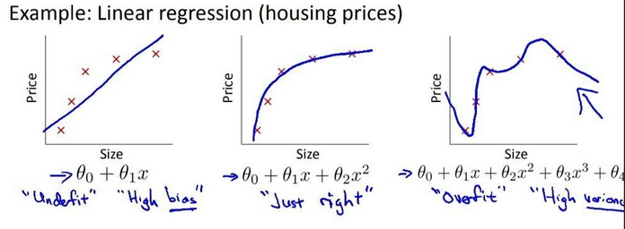

{: .center-block :}

## How is ML different from Traditional Programming?

Traditional Programming involves the manual or scaffolded (_i.e._ already written previously and hence cloned/repeated) logical process of writing a way to convert a certain input into desired output according to certain predefined constraints. So in short:

~~~
Traditional Programming:
Input + Program (by coder) = Output
~~~

Machine Learning (ML) and its related fields, in contrast, automate this manual process of coming up with the logical program by seeing a big set of correct inputs and their corresponding correct outputs, and “learning” this mapping of input to output called as **_model_**.

And then use this generated **_model_** with a new set of inputs to predict a new set of outputs. So in short:

~~~
Machine Learning:
a.) Input + Output = Model 
b.) Model + new Input = new predicted Output
~~~

### How does this “learning” happen?
“Learning” happens in the training phase when a huge set of correct inputs and their corresponding correct outputs are assembled and used in training to get a model which can then be used to make predictions on new input values.

>This huge set of correct input and output together is called the training set.

Finally, when the model is done training, we can then predict the outputs for a new set of input values.

>This set is known as the test set on which we test the accuracy of the network.

## History:

If we look at the world of tech in the last 10 years (2010–2019), one field of study which has made humongous progress is ML.

Before this decade, due to the absence of compute resources supporting heavy parallelization of tasks required for ML algorithms, these algorithms were only used in small pockets of _E-Commerce_ and _Digital Marketplace_ websites to serve recommendations.

At the beginning of the decade, when GPUs started trending and heavy parallelization of calculations was a reality, this field and sub-fields like Deep Learning, other related fields like Computer Vision saw rapid advancements with new State-of-the-Art models released every 3 to 6 months, performing better from the predecessor models in terms of one or more measures like **_accuracy_**, **_generalization_**, **_robustness_**, **_ease-in-training_**, and **_explainability_**.

## What does each of these terms mean?

**_Accuracy_** _refers to the degree to which the ML model was able to predict the correct output. This output can be a categorical variable (i.e. a yes or a no answer) or a number (i.e. price of certain company’s stock)._

**_Generalization_** _means how an ML model is able to predict for a domain of tasks after being “trained” to make predictions for a similar domain of tasks._

_i.e. Can a model trained to distinguish between cats and dogs also be extended to other animals, like a human and a chimp?_

**_Robustness_** _means how an ML model can deal with “weird edge-cases” of input. i.e. Can a model being trained to distinguish between human and dog also distinguish them when the human is wearing a dog-suit and the dog is wearing a t-shirt?_

**_Ease-of-training_** _measures to how much compute resources and training time (i.e. time taken for a model to “learn” to predict correct output given was spent to train a model to reach a given accuracy measure on a varied set of test inputs. i.e. If a model A requires 4 hours of training time to distinguish between a human and a dog with 80% accuracy and a model B does the same in 12 hours of training with same accuracy when tested on 1000 new images of humans and dogs, then model A is better because it takes less time to train and re-train._

**Note**: Apart from training time, inference time (i.e, time taken for a model to give out prediction for a given input) of different models can also be different, but generally this time is much smaller than the training time, and hence is not that much of an issue unless input supplied is enormously huge.

>Notice how similar it is to traditional programming where to solve a task A and give correct output if one piece of code A does it in O(n) linear time complexity, and another piece of code B does it in O(n^2) polynomial time complexity, then the first piece of code A will be considered better because it will perform immensely faster for a huge input.

**_Explainability_** _refers to the ease with which what the model is learning at each step of training, and what small results it is predicting at each phase of inference can clearly be demonstrated to any person having no prior introduction to ML, who just understands the domain of the problem for which the model was built._

_i.e. If a model is used to decide when to sell or buy stocks of a given company. Explaining what factors does the trained model take into consideration after being trained to get to the results to an experienced Technical Stock Analyst by a ML engineer counts as its_ **_explainability_**.

>There has been huge push after 2017–2018 for models to be more explainable to domain stakeholders so that questioned like whether it is biased towards a certain type of input, or it treating all input fairly, or is not breaking any rules of the ecosystem can be verified by the domain experts who might not be ML experts.
>
>These advancements garnered much-needed support due to a recent common interest in data protection of consumers and what data points do sophisticated ML algorithms consider for making any decision and do they follow all moral, legal rules while doing so.

## What are the different types of ML algorithms?

On the basis of the training set being given to them, ML algorithms are broadly divided into:

### Supervised Learning:

In **_supervised_** learning, both the input (also known as **non-target attributes**) and its correct output (also known as the **target attribute** or **ground truth**) that should be predicted by the model in the best case are provided.

And the task is to learn a function F, that takes the non-target attributes **X** and output a value that approximates the target attribute, _i.e._ **F(X)≈y**. The target attribute y serves as a teacher to guide the learning task since it provides a benchmark on the results of learning. Hence, the task is called supervised learning.

>i.e. In the Iris data set, the category of iris flower can serve as a target attribute. The data with a target attribute is often called “**labeled**” data. Based on the above definition, for the task of predicting the category of iris flower with the labeled data, one can tell that it is supervised learning.

### Unsupervised Learning:
Different from supervised learning, we do not have the ground truth in an unsupervised learning task. One is expected to learn the underlying patterns or rules from the data, without having the predefined ground truth as the benchmark.

[Clustering algorithms](https://developers.google.com/machine-learning/clustering/clustering-algorithms) are one of the examples of unsupervised learning.

### Semi-supervised Learning: 
In a scenario where the data set is massive but the labeled samples are few, one might find the application of both supervised and unsupervised learning. We can call this task as **_semi-supervised learning_**.

>i.e. If one would like to predict the label of images, but only 10% of the images are labeled. By applying supervised learning, we train a model with the labeled data, then we apply the model to predict the unlabeled data. It would be hard to convince ourselves that the model would be general enough, after all, we learned from only the minority of data set. A better strategy could be to first cluster the images into groups (unsupervised learning), and then apply the supervised learning algorithm on each of the groups individually.
>
>The unsupervised learning in the first stage could help us to narrow down the scope of learning so that the supervised learning in the second stage could obtain better accuracy.

On the basis of the type of predictions the ML algorithms are making, ML algorithms are broadly divided into:

### Regression algorithms:

The algorithms that predict a continuous number value, like temperature prediction in a day, or stock price for a given stock at a particular time are called regression algorithms.
Examples of regression algorithms are [Linear Regression](https://en.wikipedia.org/wiki/Linear_regression), [Multi-variate Regression](https://brilliant.org/wiki/multivariate-regression/), etc.

### Classification algorithms:

The algorithms that predict a discrete categorical value, like the prediction of whether someone has COVID-19 or not based on the chest X-Ray (true or false), or whether the given image has a cat, dog, or human in it (cat or dog or human) are called Classification algorithms.

One example of classification algorithms is [Logistic Regression](https://en.wikipedia.org/wiki/Logistic_regression).

## What are the common issues with predictions made with ML models:

Although there are many issues with the predictions made with ML models, we are going to focus on two broad types:
Example of underfitting, just-right fit, and overfitting for a Linear Regression model predicting housing prices.

{: .center-block :}

Example of underfitting, just-right fit, and overfitting for a Linear Regression model predicting housing prices. 

**Source**: Publicly Open MOOC [Machine Learning by Stanford from Coursera](https://www.coursera.org/learn/machine-learning)

### Underfitting

An underfitting model is the one that does not fit well with the training data, _i.e._ significantly deviated from the training set target variables.

One of the causes of underfitting could be that the model is over-simplified for the data, therefore it is not capable to capture the hidden relationship within the data.

As one can see in the above picture, in part 1, in order to predict the house prices, the almost linear line is not able to predict housing prices correctly and the difference between the predicted price and actual price is too much. Here, a simple linear model (a line) is not capable to “fit” the price curve, which results in significant error is price prediction.

As a countermeasure to avoid the above cause of underfitting, one can choose an alternative algorithm that is capable to generate a more complex model from the training data set.

One can also have a big and diverse training set to avoid the underfitting of the model.

>_Underfitting is also can be intuitively linked to_ [high bias](https://en.wikipedia.org/wiki/Bias%E2%80%93variance_tradeoff), _as here the model is under the high bias of the principle that the prices of the house increase linearly with the area (size) of the house_.

### Overfitting
An overfitting model is the one that fits well with the training data, _i.e._ little or no error, however, it does not generalize well to the unseen data.

Contrary to the case of underfitting, an over-complicated model that is able to fit every bit of the data, would fall into the traps of noises and errors. 

As one can see from the above picture, in part 3, the model managed to have mostly zero error for price prediction in the training data, yet it is more likely that it would stumble on the unseen data.

Similar to the underfitting case, to avoid the overfitting, one can try out another algorithm that could generate a simpler model from the training data set.

Alternatively, one stays with the original algorithm that generated the overfitting model, but adds a regularization term to the algorithm, _i.e._ penalizing the model that is over-complicated so that the algorithm is steered to generate a less complicated model while fitting the data.

>_Overfitting is also can be intuitively linked to_ [high variance](https://en.wikipedia.org/wiki/Bias%E2%80%93variance_tradeoff)_, as here the model is predicting very specific prices decreasing or increasing suddenly the compared to the area of the house just smaller or higher than the current input area of the house because it has overfitted on the training data._

>_And hence, proving our intuition, the overfitted model has a_ [high statistical variance](https://en.wikipedia.org/wiki/Variance) _for the prices of the house when plotted w.r.t. the independent variable, which is the area (size) of the house_.

### Resources

From here on, you can learn further about the above-presented topics from:

- [LeetCode Machine Leaning 101](https://leetcode.com/explore/learn/card/machine-learning-101/)
- [Machine Learning Crash Course — Google Developers](https://developers.google.com/machine-learning/crash-course/ml-intro)
- [Machine Learning by Stanford from Coursera](https://www.coursera.org/learn/machine-learning)
- [Deep Learning Specialization from Coursera](https://www.coursera.org/specializations/deep-learning)
- [fast.ai](https://www.fast.ai/)‘s Machine Learning and Deep Learning Course

Thanks for reading till the last bit!

I am Ravi Vats, a Software Engineer at [Grab](https://www.linkedin.com/company/grabapp/life/4ca32942-1bfb-446c-aecb-94249a6d6702/), and Computer Science and Engineering Graduate from [Ramaiah Institute of Technology](http://www.msrit.edu/), Bangalore.

My areas of interest are domains like Deep Learning, ML, Algorithms & Data Structures, Scalable & Concurrent Systems, Data Analysis & Visualization. [Here](https://github.com/ravivats) is my GitHub handle.

You can connect with me on my [LinkedIn](https://www.linkedin.com/in/ravi-vats/) profile.

Alternatively, I am also available on [Twitter](https://twitter.com/ravivats_), [Facebook](https://www.facebook.com/ravivats01), [Instagram](https://www.instagram.com/iamravivats/), [Quora](https://www.quora.com/profile/Ravi-Vats-5).

I hope you find this blog series interesting and resourceful. I am always open to any edits or suggestions to enhance the information provided.

Cheers to learning! :)
