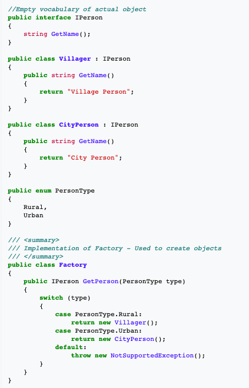
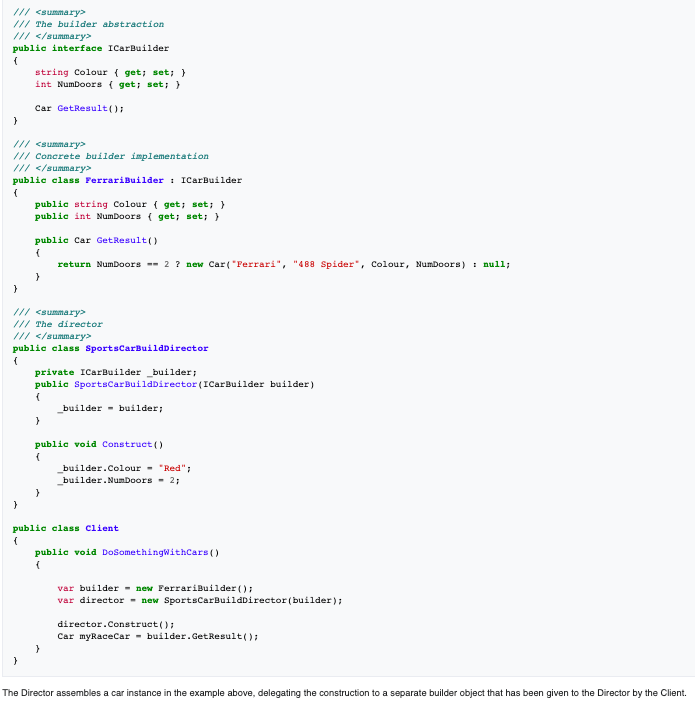
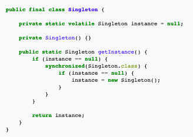
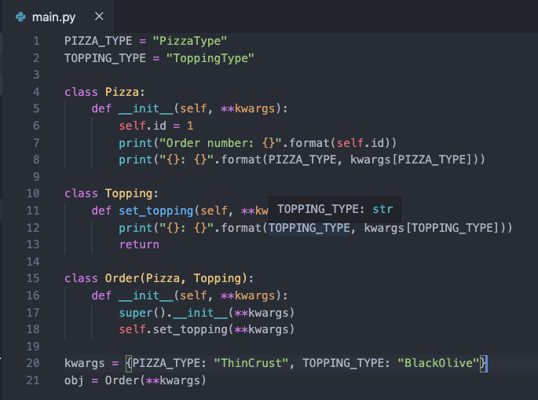
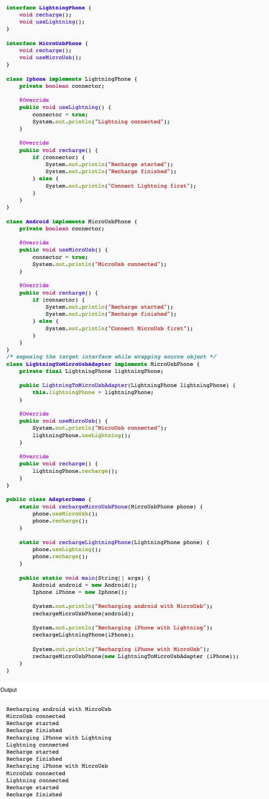

{: .center-block :}

The other day, a friend asked me on how I go about choosing a design pattern in a given scenario, because it was not always very clear.

Some design patterns are similar in terms of functionality (i.e. factory vs. builder)

I presented my intuitions via chat, and at the end of the discussion we both realized that with these intuitions for some of the design patterns in mind, choosing next time among them will be easier.

Hence, I thought of documenting and sharing it with everyone.

## [Factory](https://en.wikipedia.org/wiki/Factory_method_pattern)

Say that you are shopping from a factory outlet of a clothing company. You will only get t-shirts based on the size grades i.e. S, M, L, XL etc.

Hence, single input from our side i.e. S, M, L, XL etc. will define the whole t-shirt.

>Similarly, when you want to specify a single input argument like a keyword or an **_ENum_**, and get a variation of the main **_abstract class/interface TShirt_** created for you like **_SmallSizeTShirt_**, then you should go with **_Factory_** pattern.

Similar example is covered here, with **_abstract class/interface Person_** and its custom variations **_Villager_** and **_CityPerson_** created for use that are created on the basic of a single input, the **_enum PersonType_**.

{: .center-block :}

Factory Design Pattern in C#. Source: [Wikipedia](https://en.wikipedia.org/wiki/Factory_method_pattern)

## [Builder](https://en.wikipedia.org/wiki/Builder_pattern)

Now say that instead of going to a factory outlet, you want to have something that fits you better, so you went to a tailor for custom tailored shirt.

Now, the tailor will take note of various other inputs like your chest size, your arm length, your shoulder length etc.

Hence, you can see that the tailor doesn’t have grades based on only one input like size, instead he has a number of input parameters and is makes unique shirts for each customer based on the input values for each of them.

Here, tailor is synonymous with a **_builder_**.

>Hence, when there are multiple inputs from your side to construct a variation of the main **_abstract class/interface Shirt_**, use **_ShirtBuilder_** to return a **_CustomShirt_** for you based on various inputs.

Similar example is covered here, with ICarBuilder using various inputs like **_NumDoors_**, **_Colour_**, **_BrandName_** and **_ModelName_** and some code logic to construct a Ferrari 488 Spider Car.

{: .center-block :}

Builder Design Pattern in C#. Source: [Wikipedia](https://en.wikipedia.org/wiki/Builder_pattern)

## [Singleton](https://en.wikipedia.org/wiki/Singleton_pattern)

Suppose, you have a DB connection to initialize, and you want this DB connection to be established with your DB, and then every time you want to query for some data in a function, you get the **_same Connection object in establishedConnection state_** returned, to quickly query data.

>In such scenarios where, not only do you want the same type of object to be returned, but you also want it to have a given state always, and for it to be a **_static method call_** to get that object, then you use the **_Singleton_** pattern.

>**_Additional feature_**: _A thread safe singleton can be created so that singleton property is maintained even in multi-threaded environment._ 
>_To make a singleton class thread-safe,_ **_getInstance()_** _method is made synchronized so that one one thread can access it at a time._

{: .center-block :}

Singleton Design Pattern supporting multi-threading in Java. Source: [Wikipedia](https://en.wikipedia.org/wiki/Singleton_pattern)

## [Mixins](https://en.wikipedia.org/wiki/Mixin)

Suppose you are being told to make a system to accept pizza orders for a restaurant.

Here, **_class Pizza_** itself has many variations like **_ThinCrust_**, **_ThickCrust_**, **_ExtraCheese_** etc.

And, on-top of pizza you have a extra class like **_class Topping_** which has variations like **_Mushroom_**, **_BlackOlives_**, **_Pineapple_** etc.

Here, any **_Topping_** can go with any **_Pizza_** and vice versa.

>Hence, for this kind of multiple inheritance requirement where:
>1. You want to provide a lot of optional features for a class.
>2. You want to use one particular feature in a lot of different classes.
>
>For cases like these, you can use the **_Mixin_** pattern.
>
>**Note**: _Mixins only exist in languages that support multiple-inheritance. You can’t do a mixin in Java or C#._

{: .center-block :}

Mixin Design Pattern (Pizza-Topping Example) in Python

{: .center-block :}

Output for above example

## [Adapter](https://en.wikipedia.org/wiki/Adapter_pattern)

Suppose that you have to build an app interface for users to orders food from different restaurants. Here, menu shown to the user on your app is same for every restaurant, but the order information that each restaurant gets in slightly different.

>In cases like these, where one common input has to be mapped to different kinds to input or actions taken we should use the **_Adapter_** Pattern.
>
>**_Intuition_** is that adapters like charging adapter in real world do exactly the same thing. They send normal AC current coming at a fixed voltage-current range from the main socket into different charger pins for different devices like camera, phone, usb charger pin etc., all with their own voltage-current range.

Similar example is covered here, where different charging styles for **_LightningPhone_** and **_MicroUsbPhone_** are defined via interfaces.

Class **_IPhone_** implements only **_LightningPhone_** interface (it can only be charged via Lightning) and class **_Android_** implements only **_MicroUsbPhone_** interface (it can only be charged via Micro USB).

Now, the class **_LightningToMicroUsbAdapter_** helps to implement **_MicroUsbPhone_** interface and helps charge class **_Android_** with that, which otherwise was not possible.

{: .center-block :}

Adapter Design Pattern in Java. Source: [Wikipedia](https://en.wikipedia.org/wiki/Adapter_pattern)

## Reference Links:
- [Factory pattern](https://en.wikipedia.org/wiki/Factory_method_pattern)
- [Builder pattern](https://en.wikipedia.org/wiki/Builder_pattern)
- [Singleton pattern](https://en.wikipedia.org/wiki/Singleton_pattern)
- [Mixin Pattern](https://en.wikipedia.org/wiki/Mixin): [Forum Discussion](https://stackoverflow.com/questions/533631/what-is-a-mixin-and-why-are-they-useful), [Blog](https://www.residentmar.io/2019/07/07/python-mixins.html)
- [Adapter Pattern](https://en.wikipedia.org/wiki/Adapter_pattern)
- Other design patterns and their categories:
  - [GangOfFour](https://www.amazon.com/Design-Patterns-Object-Oriented-Addison-Wesley-Professional-ebook/dp/B000SEIBB8) (Classical book on Design Patterns)
  - [Blog](https://refactoring.guru/design-patterns/catalog)

Thanks for reading till the last bit!

I am Ravi Vats, a Software Engineer at [Grab](https://www.linkedin.com/company/grabapp/life/4ca32942-1bfb-446c-aecb-94249a6d6702/), and Computer Science and Engineering Graduate from [Ramaiah Institute of Technology](http://www.msrit.edu/), Bangalore.

My areas of interest are domains like Deep Learning, ML, Algorithms & Data Structures, Scalable & Concurrent Systems, Data Analysis & Visualization.

You can connect with me on my LinkedIn profile & follow my [GitHub](https://github.com/ravivats) page.

Alternatively, I am also available on [Twitter](https://twitter.com/ravivats_), [Facebook](https://www.facebook.com/ravivats01), [Instagram](https://www.instagram.com/iamravivats/), [Quora](https://www.quora.com/profile/Ravi-Vats-5).

I hope you find this series interesting and resourceful. I am always open to any edits or suggestions to enhance the information provided in this series.

Cheers to learning! :)
