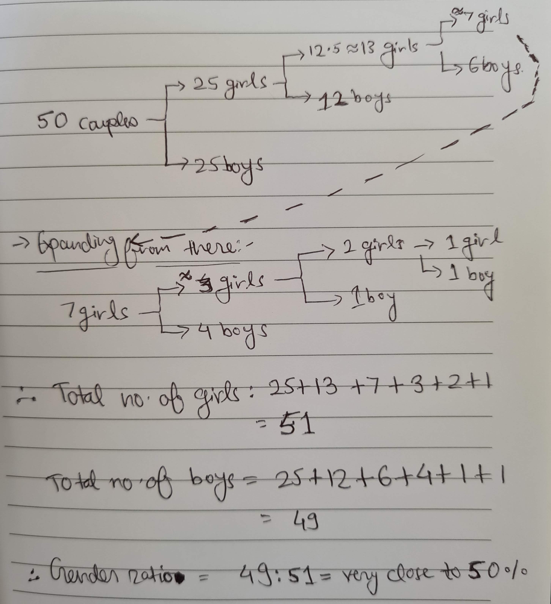

{: .center-block :}

As the world moves from compute-intensive system architectures to data-intensive system architectures,
new technology roles like Product Analysts, Data Analysts, Data Engineers, ML Engineers, and Data Scientist have come up. 

So, statistics & probability become important concepts and hence, candidates interviewing for these new roles are generally asked questions to test these concepts.

Even if you are not in these roles, and in the core Software Engineering domain instead, still statistics, probability, and SQL remain the core concepts for beginning to understand any dataset and derive any meaning or predictions out of it, or write any computer logic around it.

Let us look at some of interesting questions that were asked in FAANG interviews for these roles:

1. Amy and Brad take turns in rolling a fair six-sided die. Whoever rolls a "6" first wins the game. Amy has the first turn. What is the probability that Amy wins?
    
    **Solution**: The flow of the game is that the die is rolled multiple times till a "6" is rolled.

    So, Amy can win on the first roll, third roll, fifth roll, and so on.
    
    Probability of Amy winning in the first roll = P(six rolled by her) = 1/6

    Probability of Amy winning in the third roll = P(six NOT rolled by her in first try) * P(six NOT rolled by Brad in first try) * P(six rolled by her in 2nd try) = (5/6) * (5/6) * (1/6) = 1/6 * (5/6)^2

    Similarly, the probability of Amy winning in the fifth roll = (1/6) * (5/6)^4

    Similarly, the probability of Amy winning in the seventh roll = (1/6) * (5/6)^6

    Hence, total probability of Amy winning = Sum of all such events = (1/6) + (1/6 * (5/6)^2) + (1/6 * (5/6)^4) + (1/6 * (5/6)^6) + and so on..

    This series of events is an infinite geometric progression i.e. GP with a = 1/6, and r = (5/6)^2 = 25/36.

    The sum of such infinite GP series is = a/(1-r) = (1/6) / (1 - 25/36) = (1/6) / (11/36) = 6/11

    Hence, probability of Amy winning in any of her turns = 6/11.

    > **Note**: This also means that probability of Brad winning in any of his turns = 1 - P(Amy winning) = 5/11

    > **Intuition**: This shows you that in each board game, the probability of winning for the player that takes the first turn is always slightly greater than his opponent. 
    > Intuition is that, yes that should happen right? It makes sense because player one always gets the first chance of making a potential right move in 1st turn, 3rd turn, 5th turn, and so on, while player two gets this chance afterward in this series with 2nd turn, 4th turn, 6th turn, and so on.

2. In a village in India, the authorities were alarmed about a weird family planning custom & started investigating the issue. They found out that in that village, couples were told that if they have a girl child, they should try again for a boy child, and stop only when they have a boy child born. And if they have a boy child born as a firstborn, they should stop planning for more children. Authorities were very worried that this ritual may create gender ratio imbalance. So they hired you, to verify using statistics and probability, if this problem will occur. Calculate the impact of this ritual on gender ratio.

    **Solution:** 

    ***Long way to solution***: Let us take an example case study, suppose 50 couples in the village are fit to have children.

    So, given that every couple will give birth to one child approx. (not considering twins as a case because they are rare), and the probability of a girl or boy being born for an individual birth is 50% each approximately, and that they follow the custom, we can chart down the sequence of births, which is:

    {: .center-block :}

    As the gender ratio remains approx. 50% as the no. of couples becomes larger and larger than 50. We can conclude that this practice doesn't have an impact on it.

    > ***Intuition/Short way to solution***: The ratio would still be 50% because the probability of a boy or a girl being born is just related to the couple themselves and it is not related to (in other words, is *disjoint* to) any separate external event of weird rules being followed in society.

3. Four people A, B, C & D get in a lift on the ground floor. Each of them has a choice of getting down on floors 1,2,3 & 4. What is the probability that all of them come out on different floors?
    
    **Solution**: Total no. of choices of getting out for each person = 4

    Hence, total number of ways people can get out = 4 * 4 * 4 * 4 = 256
    
    Now, total number of ways in which people can get out on different floors = ABCD, BACD, ..., etc = 4P1 = 24.
    
    Therefore, probability P(E) =  24/256 = 3/32.

4. Imagine a deck of 500 cards numbered from 1 to 5000. If all the cards are shuffled randomly and you are asked to pick 3 cards, one at a time, what is the probability of each subsequent card being larger than the previously drawn card?

    **Solution**: Let us assume that the 3 drawn cards have numbers A, B, C, where A < B < C.
    
    They can be pulled in the sequence of ABC, BAC, ... etc.
    
    Hence, the total numbers of sequences they can be pulled out = 3P1 = 6
    
    In those 6 sequences, only in ABC sequence, each subsequent card being larger than the previously drawn card.
    
    Hence, no. of favorable sequences: 1
    
    Therefore, probability P(E) = 1/6.

Thanks for reading till the last bit!

I am Ravi Vats, a Software Engineer at [Grab](https://www.linkedin.com/company/grabapp/life/4ca32942-1bfb-446c-aecb-94249a6d6702/), and a Computer Science and Engineering Graduate from [Ramaiah Institute of Technology](http://www.msrit.edu/), Bangalore.

My areas of interest are domains like Deep Learning, ML, Algorithms & Data Structures, Scalable & Concurrent Systems, Data Analysis & Visualization. [Here](https://github.com/ravivats) is my GitHub handle.

You can connect with me on my [LinkedIn](https://www.linkedin.com/in/ravi-vats/) profile.

Alternatively, I am also available on [Twitter](https://twitter.com/ravivats_), [Facebook](https://www.facebook.com/ravivats01), [Instagram](https://www.instagram.com/iamravivats/), [Quora](https://www.quora.com/profile/Ravi-Vats-5).

I hope you find this blog series interesting and resourceful. I am always open to any edits or suggestions to enhance the information provided.

Cheers to learning! :)
