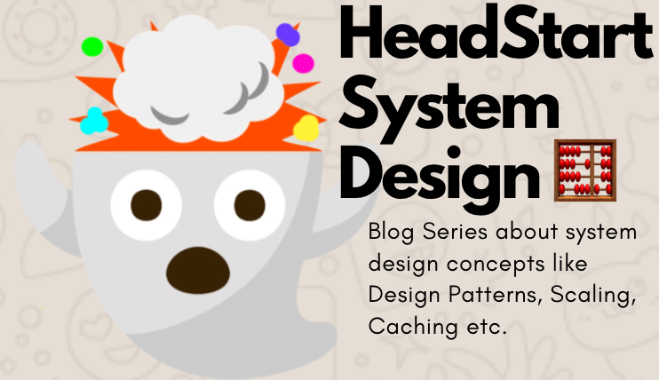
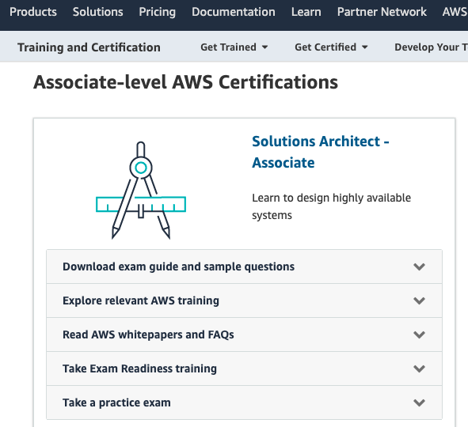
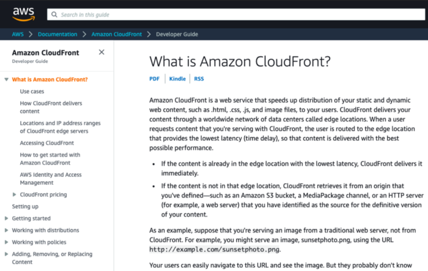

{: .center-block :}

AWS offers various certification programs aimed towards Software Development, Solution Architecture, Machine Learning Engineering, Cyber Security, etc.

Taking these certifications is a good idea if:

1. You are someone who has been using AWS services as a part of the solution in the tech stack you are working on for more than a year
2. Or, you are someone who wants to learn more about cloud tech and the services offered and how to use them for your working domain (ML, Cyber Security, Solution Architecture, etc.)

Since I checked both of the above points, I decided to sign up for the certification and cleared it in Dec 2020.

## How I prepared for my AWS certifications

There are many different paths available.

***1. You can head to the AWS [certification page](https://aws.amazon.com/certification/certification-prep) and choose the exam that you want to prepare for. Preparation included:***

{: .center-block :}

Source: [AWS Certification Prep Homepage](https://aws.amazon.com/certification/certification-prep)

  a. Reading standard white-papers illustrating solutions for a given type of business problem.
  > This gives an idea about general patterns of solutions you are expected to come up with during the examination.
  
  b. Reading up about common services using AWS Documentation (more about it in point 2).

  c. Solving sample questions, previous exam questions, and taking a practice exam.

  d. You can take AWS Certification online training given by their experts also.

***2. For the various services offered by AWS for your domain, browsing into AWS documentation for those services, to understand things like:***

{: .center-block :}

Source: [AWS CloudFront Documentation](https://docs.aws.amazon.com/AmazonCloudFront/latest/DeveloperGuide/Introduction.html)

  - How is this service priced? What are the different types of variants of the service available?

  - Is this service auto-scalable? Is this service serverless?

  - ***Hands-on labs*** -> Setting up the service in your developer account (in free tier) and trying out requests and checking the responses from the service.

  - Comparing the service to its alternative offerings. I.e. RDS for MySQL vs. Aurora for MySQL -> Which service should be used when? What are the pros and cons of the service when compared to its alternatives?

  - Understanding where does this service fits in the whole flow. I.e.
    - AWS Cloudfront fits in the flow whenever some content needs to be available to the public at low latencies.
    - AWS DynamoDB and DAX (DynamoDB Accelerator) fits in the flow whenever highly scalable E-commerce, web applications need a highly scalable DB for micro-second latencies.

***3. You can also choose to go through a comprehensive certificate preparation course with all of the above-mentioned things (documentation, white-papers, general patterns, sample questions, hands-on labs, etc.) collected in one place.***

Some good courses are (in my case, for AWS Solutions Architect Associate Certification):

1. [A Cloud Guru Solutions Architect Associate](https://acloudguru.com/course/aws-certified-solutions-architect-associate-saa-c02)
2. [Pluralsight: AWS Certified Solutions Architect — Associate](https://www.pluralsight.com/courses/aws-certified-solutions-architect-associate)
3. [Ultimate AWS Certified Solutions Architect Associate 2021](https://www.udemy.com/course/aws-certified-solutions-architect-associate-saa-c02) by [Stéphane Maarek](https://twitter.com/stephanemaarek)
  - (In addition to the official AWS websites, I purchased and used this one to prepare)
  - Instead of watching the videos. I went through the slides provided for all the videos in this course.
  - After completing the slides for one section (i.e. EC2), I would solve the quiz provided for the section.
  - After completing going through all slides and quizzes, I would go through sample solution architectures in the course and on the AWS website.
  - At last, I solved a full practice paper with 65 questions and a 130-minute time limit, like in the real exam for practice.

## Things I learned from the certification

Apart from learning in detail about the AWS services when doing the certification prep, one also learns a lot about system design and how to come up with solution architectures for various business needs.

Most of these concepts are cloud-platform agnostic and help build a foundational understanding of system design, things to consider while designing a new solution, or suite of microservices, or any other web/cloud components talking to one another.

These concepts are wrapped around general cloud platform agnostic (is for any cloud provider Like AWS, Azure, Google Cloud , etc.) questions. For example:

1. What is meant by scalability? (i.e. Horizontal scalability vs vertical scalability, What is auto-scaling, on which metrics can we scale in or out (CPU %, Network in, Network out, etc.)
2. What are the different ways of storing data? Structured (SQL), semi-structured (NoSQL, JSON), unstructured (Files in NFS, tapes, etc.)
3. What is load balancing? Different types like Load Balancing on Application layer vs. Network Layer?
4. What is rate-limiting? And why it is important? What are its different levels (Rate limit on the gateway vs. Rate limit per microservice vs. Rate limit per instance vs. Rate limit per client)
5. What is a firewall? Why is it necessary? How does it prevent internal services from DDoS attacks, etc.?
6. What are the common ports used on different protocols and applications? I.e. Port 22 is for SSH, Port 80 is for HTTP, Port 443 is for HTTPS, Port 3306 is for MySQL, etc.
7. What is caching? Why it is important for performance and saving compute? How to optimally do cache invalidation?
8. Write-through vs. Write-back for writing cache values to DB.
9. Why are CDNs important? How does caching work in CDNs? How does having servers at the edge helpful in reducing latencies to serve consumers?
10. What is serverless architecture? Why is it so popular nowadays? What is a typical serverless alternative to a 3 tier normal cloud architecture having a Gateway, Load Balancer, Scaling Group, Computer Instances, and DB Instances?
11. When to use pub-sub mechanism vs. when to use queues? How these two messaging channels can be used to decouple systems from one another? What is the fan-out architecture?
12. What is the difference between OLTP DB (like Aurora) vs. OLAP DB (like Redshift)? Why are OLAP DBs having columnar storage, unlike OLTP DBs which are row based?
13. How are graph DBs (i.e. Neptune) different from OLTP, OLAP, or NoSQL DBs and when should they be used?
14. How being multi-region or multi-availability helps in being highly available and DR (i.e Disaster recovery) compatible? How does failover happen when one region goes down? (Hint: Based on health checks of the instances)
15. For DBs, how does having read-replicas help in increasing DB performance? Can we couple read replicas and caching for a DB?
16. What is encryption at rest vs. encryption in transit? What is symmetric vs. asymmetric encryption? What is server-side vs. client-side encryption?
17. What is authentication and how it is different from authorization? Why is the least needed privilege ideal for authorization? How to scale authorization using entities like users, groups, roles, and policies? What are the common standards for auth like the OAuth API flow? What is MFA and why is it recommended nowadays days?
18. What is the difference between SDK, framework, and library? And when to provide which of these to the clients?
19. What is whitelisting? What is inbound IP vs. outbound IP whitelisting?

Thanks for reading till the last bit! Wishing you the best with your cloud certification Journey!

I am Ravi Vats, a Software Engineer at [Grab](https://www.linkedin.com/company/grabapp/life/4ca32942-1bfb-446c-aecb-94249a6d6702/), and a Computer Science and Engineering Graduate from [Ramaiah Institute of Technology](http://www.msrit.edu/), Bangalore.

My areas of interest are domains like Deep Learning, ML, Algorithms & Data Structures, Scalable & Concurrent Systems, Data Analysis & Visualization. [Here](https://github.com/ravivats) is my GitHub handle.

You can connect with me on my [LinkedIn](https://www.linkedin.com/in/ravi-vats/) profile.

Alternatively, I am also available on [Twitter](https://twitter.com/ravivats_), [Facebook](https://www.facebook.com/ravivats01), [Instagram](https://www.instagram.com/iamravivats/), [Quora](https://www.quora.com/profile/Ravi-Vats-5).

I hope you find this blog series interesting and resourceful. I am always open to any edits or suggestions to enhance the information provided.

Cheers to learning! :)